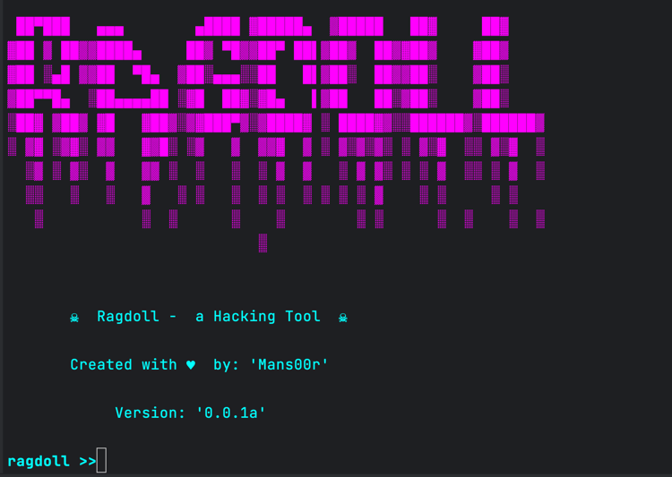
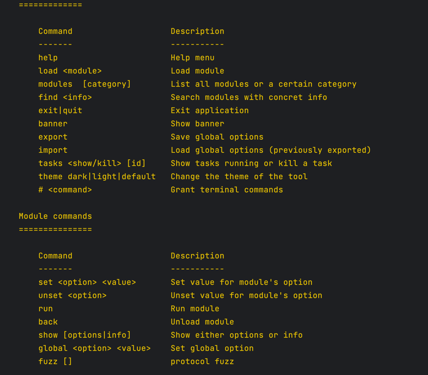

一个人从HomePwn分离出来的工具模版，用于快速开发自己的shell安全工具

`python3 ./main.py`

## utils
### core
> 1.color 定义主题颜色
- class: [CommandPalette]: 指定各种类型颜色
- class: [ColorSelected]: 加载主题
- dict: [colors_terminal]: 设置自己的主题
> 2.print 自定义打印函数
- func: [error]: 红
- func: [msg、body]: 白
- func: [info]: 黄
- func: [ok]: 绿
> 3.help 帮助界面
- func: [show_help] : [core cmd] + [mod cmd] + [extra(dict)]
> 4.glb_list 全局变量存储
- class: [Global]: 全局变量存储
> 5.logger 日志处理
- class: [Logger]: 对产生的日志进行记录
> 6.check 检查模块
- func: [is_root]: 是否root用户权限
> 7.exception 异常处理模块
- func: [exception]: 异常处理
> 8.dynamic_load 动态加载模块
- func: [dynamic_load]: 加载模块，返回模块实例
> 9.find 寻找模块内容
- class: [Find] 寻找内容，除去_和__下划线开头文件
> 10.tasks : 任务管理模块
- class: [Task]: 执行任务管理
> 11.thread 多任务管理

> 12.kill_process 进程管理

> 13.dataset 全局默认选项

### logs&files
日志，全局变量存放目录
### shell
>1.banner 展示界面

>2.command_parser 核心命令参数处理

>3.completer 自动补全

>4.prompt 提示词

>5.shell_options 模块命令参数处理

## modules
所有自定义模块均要继承Module类，必须提供run方法
